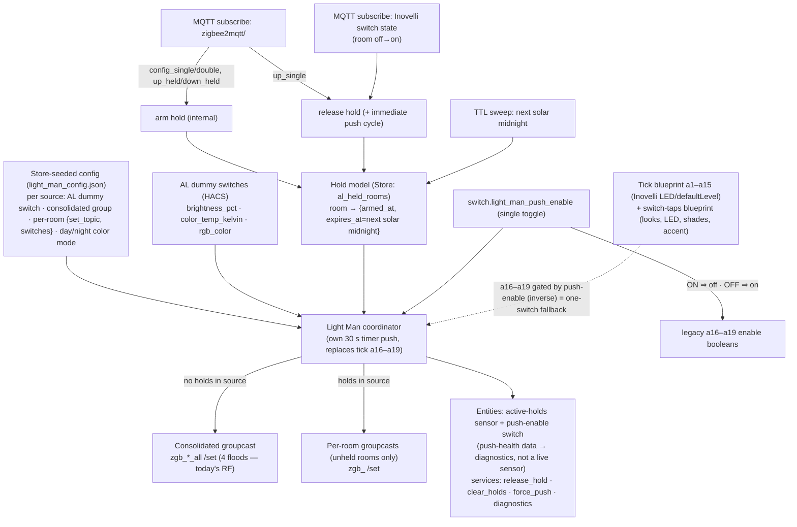

# Plan — Light Man Phase 1: own the adaptive push + scene-hold (regression fix)

> **Revision note (2026-06-08).** This supersedes the earlier "dynamic Zigbee group membership"
> design. After reading the reference pack we chose to **do it right the first time**: Light Man owns
> the per-source adaptive push and excludes held rooms by **addressing** (consolidated groupcast vs.
> per-room groupcasts), not by mutating group membership. That deletes the bind/unbind primitive, the
> transaction-correlation registry, the retry state machine, and the membership reconciler. The
> per-source day/night color-mode is now a **live push feature** (no shadow blueprint config).
> A second pass simplified further: single solar-midnight hold TTL, memory-only dedup (no Store),
> one active-holds sensor (push-health → diagnostics), release reuses the push path, no `arm_hold`
> service. `docs/reference/ARCHITECTURE.md` is kept in sync.

## Context

The AL refactor (Stage 0/1/2b consolidation) collapsed per-room AL pushes into **4 per-source group
floods** (tick areas a16–a19) that drive every bulb via native `multiColor` groupcasts to consolidated
Z2M groups (`zgb_overhead_all`, `zgb_accent_all`, `zgb_hallway_up/down`), each gated only by a
**global** source-enable boolean.

**Regression confirmed (evidence-traced):** a per-room manual *light* look can no longer be protected
from the next tick.
- Per-room scripts (e.g. `al_living_room_recessed`) have `group_set_topic: ""` blanked → they drive
  only the Inovelli switch (defaultLevel/LED), never bulbs (`al-source-scripts.yaml:58`).
- Bulb color/brightness now comes solely from a16–a19, gated by **global** source booleans. The
  per-room enable the switch taps toggle no longer gates any bulb push.
- So Config Day/Night and Held-dim set a look, but the next flood (~92 s) overwrites it. rc30 dedup
  compares the new AL target vs the last *AL* target (`input_text.al_last_published`), not vs the
  bulbs' scene state, so it gives **no** protection (`tick-blueprint.yaml:996-997`).
- Double/triple paddle taps are wired to **PowerView shade scenes**, not lights
  (`switch-tap-instances.yaml`) → they must **not** arm holds.

**Root cause (architectural):** override is a per-room/per-light concept, but adaptation is now a
per-source group **multicast** that cannot exclude individual members. This logic is
stateful/async/error-heavy — the most fragile YAML yet if done in blueprints, and the latest in a
series of subtle bugs (LR latch, mid-fan-out tick split, hallway drift, keyed-JSON migration) showing
the stack has outgrown YAML/Jinja.

**Decision:** build the custom HA integration and **own the per-source adaptive push** (tick areas
a16–a19) as its first feature. Held rooms are excluded by *addressing* — flood the consolidated group
when nothing is held, flood per-room groups (skipping held rooms) when a hold is active. The tick
blueprint keeps the per-room Inovelli writes (a1–a15) and stays as an instant fallback.

## Design evolution (why this differs from the membership plan)

The reference pack settled three things that flipped the mechanism:

1. **Every bulb is in both its per-room group *and* the consolidated source group**
   (`z2m-groups.yaml:31-34`). So exclusion needs no topology change — just choose which group(s) to
   address. Per-room groups + SBM bindings are untouched → paddle on/off keeps working during a hold.
   **Light Man owns the *publish*, not the groups:** `hue_native_control` is a Z2M per-group setting;
   Z2M builds the native Philips `multiColor` groupcast (and the color-while-off prestage bit) on every
   publish to a native group. Light Man's payload is identical to the blueprint's `mqtt.publish`, so
   native Hue is preserved on both the consolidated and per-room paths — *provided every per-room
   group is also `hue_native_control: true`* (almost all already are; see §1.2 coverage check).
2. **The push is portable.** The KB-encoded fixes (hue_native_control prestage, SBM binding, latch)
   live in **Z2M config, not the push**. The push only emits stateless
   `{"brightness", "color_temp"|"color", "transition"}` to a group `/set`, plus Inovelli
   `defaultLevel`/LED, with write-on-change dedup (`al-push-script-blueprint.yaml:223-230`).
3. **Adaptive values are just three attributes.** AL "dummy" switches expose `brightness_pct`,
   `color_temp_kelvin`, `rgb_color`; the tick reads only those (`tick-blueprint.yaml:763-765`).
   Everything else in the AL integration is unused — so Light Man can replace it later by porting a
   real-elevation curve (Phase 2, `docs/reference/adaptive-algorithm.md`).

**What this deletes vs. the old plan:** the `group/members/add|remove` primitive, unique-per-attempt
`transaction` correlation, the 3-attempt retry state machine, the membership reconciler, and bind
churn. Arming a hold becomes a `Store` write; the next push addresses around it. Lost reliability is
recovered for free: the push is level-triggered (re-asserts every cycle), so a dropped flood self-heals
next cycle exactly as the tick does today.

## Integration identity

| Field | Value |
|---|---|
| INTEGRATION_NAME | Light Man |
| DOMAIN | `light_man` *(core `light` is reserved → `light_man`)* |
| REPO_URL | https://github.com/mnestrud/light-man (**public**) |
| REPO_LOCAL_PATH | `C:\Users\micha\code\light-man` |
| CURRENT_QUALITY_TIER | pre-bronze (target Silver before first internal release) |
| AUDIT_MEMORY_FILE | `light_man_audit.md` |
| PLATFORMS | `sensor`, `switch` (+ services) |
| HA_MIN_VERSION | match current live (2026.x) |
| integration_type | `hub` (local orchestrator over MQTT/Z2M) |
| iot_class | `local_push` |
| License | MIT |

**Locked design decisions (cemented — avoid remaking):**
- **Domain `light_man`** — baked into folder path, `manifest.json`, every entity `unique_id`,
  config-flow handler, service names (`light_man.release_hold`), translation keys.
- **Entity `unique_id` scheme:** `{entry_id}_{room|source}_{kind}` (e.g. `…_active_holds`,
  `…_push_enable`). Changing later orphans registry entries.
- **Config model:** UI config-flow with a **single config entry** (`single_config_entry: true`) —
  house-wide singleton. **Phase 1: the topology map + per-source color mode are seeded from a
  `Store`-loaded JSON** (`light_man_config.json`), not an interactive flow. The config-flow `user`
  step is a trivial confirm that creates the entry. The real OptionsFlow (adaptive-target profiles)
  lands in **Phase 2**.
- **Held-room exclusion is by addressing, never by group-membership mutation.**
- **Push cadence:** Light Man owns its own ~30 s timer — independent of the tick blueprint (which is
  being retired), not phase-aligned to it.
- **Hold TTL:** a single rule — `expires_at = next solar midnight` (holds always clear overnight).
- **RF during holds:** the transient per-room-flood increase for a held source is **accepted**;
  steady state (no holds) is unchanged at 4 consolidated floods.
- **Single-toggle fallback (until Phase 2):** one switch — `switch.light_man_push_enable` — swaps the
  whole stack. ON runs Light Man's push **and** turns the legacy a16–a19 enable booleans OFF; OFF
  no-ops Light Man **and** turns them back ON. The new and old stacks are therefore never flooding at
  once, and reverting is a single flip. This coupling to the legacy booleans is temporary and is
  removed in Phase 2 when the tick retires.
- **Manifest:** `integration_type: hub`, `iot_class: local_push`, `dependencies: ["mqtt"]`.

**Branch / release workflow:** `dev` = default; each robocopy deploy is preceded by a `git push` to
`dev`. `main` = stable releases only; merge `dev`→`main` and tag once stable.

## Architecture & seam



- **Light Man owns (Phase 1):** the 4 source pushes (a16–a19), hold state, dynamic addressing,
  write-on-change dedup, per-source day/night color mode, tap→hold arming via action-topic subscribe,
  and off→on release via the Inovelli switch state topics.
- **Z2M keeps owning device I/O:** groups, bindings, `hue_native_control`, Inovelli SBM. Light Man
  talks to Z2M **only via MQTT** — group/switch `/set` publishes (fire-and-forget) + `…/action` and
  switch-state subscribes.
- **Blueprints keep:** tick a1–a15 (Inovelli unicast); the switch-taps blueprint's look application,
  LED effects, PowerView shade scenes, accent toggling, held-dim ramp. Light Man only *observes* taps
  to manage holds — it does **not** apply the Day/Night look (the blueprint still does), it just stops
  the adaptive push from overwriting it.
- **Single-toggle fallback:** the `push_enable` switch is the sole control — flipping it ON drives the
  legacy a16–a19 enable booleans OFF (and OFF drives them back ON), so Light Man and the tick never
  flood together and reverting to the old stack is one flip.

## Phase 0 — Bootstrap (COMPLETE)

Done and committed (`0ddfbec`, `d0412fc`): public repo (MIT), `dev`/`main`, `.github/workflows/`
(validate, docs, claude review/mention), `CLAUDE.md`, `docs/reference/` pack, partial
`custom_components/light_man/` scaffold, `hacs.json`, `pyproject.toml`, `requirements_test.txt`.
(Phase-0 `__init__.py`/`const.py` docstrings cleaned of stale membership/reconciler text.)

**Still outstanding (local, one-time):** Windows PHCC env — venv, copy `sitecustomize.py`, pin
PHCC/mypy per `CLAUDE.md`. Memory files `light_man_audit.md` / `light_man_test_env.md` and the
`## Integration: Light Man` MEMORY.md section are created locally (cannot be done in the cloud).

## Phase 1 — Own the adaptive push + scene-hold (deliverable)

### 1.1 Scaffold inventory — what exists vs. what to add

| Exists (Phase 0) | To add (Phase 1) |
|---|---|
| `__init__.py` (`PLATFORMS = []`) | set `PLATFORMS = ["sensor","switch"]`; Store load of `light_man_config.json`; hold Store; MQTT subscriptions (action topics + switch-state topics); unload cleanup |
| `const.py` (`DOMAIN`, `LOGGER_HOLD`) | source keys, color-mode enum, defaults, push interval (30 s), mired clamp (153–500), topic templates |
| `config_flow.py` (single-instance user step) | keep trivial confirm step (entry creation only); **no** topology UI in Phase 1 |
| `manifest.json` (`hub`/`local_push`/`single_config_entry`/`mqtt`, v`0.0.0`) | bump `version` |
| `strings.json`, `translations/en.json` | confirm step + service/error strings (mirror both) |
| — | `coordinator.py` (push engine + hold manager + dedup), `sensor.py` (1 active-holds sensor), `switch.py` (1 push-enable switch), `services.yaml`, `icons.json`, `diagnostics.py` (incl. push-health data), `tests/` (incl. `conftest.py`), seed `light_man_config.json` |

### 1.2 Pre-checks (read-only, live)
- Enumerate real membership of `zgb_overhead_all` / `zgb_accent_all` and the per-room groups + their
  `/set` topics (the `z2m-groups.yaml` map is *reconstructed* — verify against `database.db` / the Z2M
  frontend) → this populates the seed JSON.
- Confirm the AL dummy-switch entity ids + attributes per source (`al-source-scripts.yaml:12,22,32,43`).
- Confirm the Inovelli `…/action` payload strings match the blueprint subtypes
  (`config_single`, `config_double`, `up_single`, `up_held`, `down_held`, …) and the switch **state**
  topic shape used for off→on detection.
- **Native-Hue coverage check (load-bearing):** confirm **every** member of `zgb_overhead_all` /
  `zgb_accent_all` belongs to a per-room group that is also `hue_native_control: true` — that is the
  group Light Man addresses through during a hold. Per `z2m-groups.yaml` almost all per-room groups
  already are; suspected orphans (no obvious native per-room group) are **front_door** and
  **michael_closet** (overhead) and **under_vanity** (accent). For each orphan, create a
  `hue_native_control: true` per-room group in Z2M (one-time), else that bulb loses color-while-off
  prestage while another room in its source is held.
- **Replaces the old §1.2 linchpin spike** — we no longer bet on Z2M rebuilding a flood for a smaller
  group; we build the per-room payload ourselves. The only "verify our port" check is that a
  hand-built per-room `/set` renders identically to the blueprint's consolidated one.

### 1.3 Config surface — Store-seeded JSON (Phase 1)
`light_man_config.json` (loaded in `_async_setup()`), shape per **source** (`overhead`, `accent`,
`hallway_up`, `hallway_down`):
```jsonc
{
  "push_interval_s": 30,
  "sources": {
    "overhead": {
      "al_switch": "switch.adaptive_lighting_al_dummy_overhead_control",
      "consolidated_topic": "zigbee2mqtt/zgb_overhead_all/set",
      "legacy_enable": "input_boolean.adaptive_lighting_overhead_all",  // tick a16–a19 gate; driven by push_enable (inverse)
      "day_color_mode": "color_temp",      // color_temp | rgb
      "night_color_mode": "color_temp",
      "sleep_switch": null,                 // hallway sources set this
      "rooms": {
        "living_room": {
          "set_topic": "zigbee2mqtt/zgb_living_room/set",
          "switches": ["zigbee2mqtt/Living Room Overhead Light Switch 1"]
        }
      }
    }
  }
}
```
- Defaults reproduce today's behavior: overhead/accent `day=color_temp,night=color_temp`; hallway
  up/down `day=color_temp,night=rgb` (sleep switch wired). The push addresses **groups/topics** only
  (`consolidated_topic` when nothing is held, per-room `set_topic` otherwise) — bulb-level data is
  intentionally **not** in the seed. Native-Hue coverage (§1.2) is a one-time human check in the Z2M
  frontend, never runtime data.
- **`rooms[*].switches`** carry each room's Inovelli switch base topic(s): `…/action` arms a hold for
  the room, and the switch **state** drives off→on release. These are the same room switches Light Man
  already adapts (defaultLevel/LED).
- **`sources[*].legacy_enable`** is the tick's a16–a19 enable boolean for that source
  (`adaptive_lighting_overhead_all`, `…_accent_all`, `…_switch_hallway` for both hallway sources).
  Light Man drives it to the inverse of `push_enable` so one switch swaps the whole stack (§1.4). It is
  the only legacy-helper coupling and is removed in Phase 2.
- **Startup validation:** every **holdable** room (one a switch can arm) must have a per-room
  `set_topic` — without it the push cannot address around the held room (it would fall back to the
  consolidated flood and hit the held bulbs). Validate the `switch → room → set_topic` chain on load;
  validate topics/entities exist; surface unmapped/odd entries in **diagnostics**, never fail setup.
  The push reads only this config at runtime — never reconstructs YAML.

### 1.4 Components
- **Push engine (coordinator)** — timer-driven on its own ~30 s cadence (independent of the tick). Per
  source: read `brightness_pct`/`color_temp_kelvin` (and `rgb_color` when in an rgb mode) from the AL
  dummy switch; compute `bri` (0–254) and `mired` (clamp 153–500); pick `mode = night_color_mode if
  sleeping else day_color_mode`. **Addressing:** if no held room in the source → one publish to
  `consolidated_topic`; else → one publish per **unheld** room `set_topic`. Payload is stateless
  (`al-push-script-blueprint.yaml:228-230`): `{"brightness", "color_temp"|"color":{r,g,b},
  "transition"}`. Never send `state` (latch fix). Guard publishes on MQTT availability — skip the cycle
  if the MQTT integration isn't connected (no exceptions on a disconnected broker).
- **Single-toggle stack switch** — `switch.light_man_push_enable` is the sole control. ON: the push
  runs **and** Light Man sets each source's `legacy_enable` boolean OFF (tick a16–a19 stop). OFF: the
  push is a no-op **and** Light Man sets the `legacy_enable` booleans back ON (tick resumes the old
  consolidated flood). On startup it reconciles the booleans to match its own state so the two stacks
  are never active together. This is the one-flip fallback through Phase 1.
- **Write-on-change dedup** — keep last-published per (source, target) in memory only; skip unchanged.
  Replaces `input_text.al_last_published`. `always_update=False` on the coordinator. No `Store`: the
  push is level-triggered, so after a restart the first cycle per source just re-publishes once
  (idempotent — it matches what's on the bulbs, or self-heals next cycle).
- **Hold model** — `Store` (`al_held_rooms`): `room → {armed_at, expires_at}`. Intent set immediately;
  the next push honors it. Holds persist across restart (the intent must survive — otherwise a restart
  re-clobbers a held scene, the very bug being fixed). No convergence step (addressing is recomputed
  each push).
- **Arm hold** — on `config_single`/`config_double` (Day/Night) or `up_held`/`down_held` (dim) for a
  room; **never** double/triple. Record the room held. The blueprint already applied the look; Light
  Man just stops overwriting it. `expires_at = next solar midnight` (holds always clear overnight; the
  house returns to adaptive every morning).
- **Release hold** — triggers: **`up_single`** (tap-on) and **room off→on** (detected on the Inovelli
  switch **state** topic — the same room switches Light Man adapts). Clear the hold, then **trigger an
  immediate push cycle** (the `force_push` routine) so the released room snaps to adaptive at once —
  reuses the push path rather than a bespoke single-room publish (with another room still held the
  cycle addresses per-room including the released one; otherwise it floods the consolidated group).
- **TTL sweep** — periodic check (piggyback the push loop) clears expired holds; emits an info line.
- **Tap / state subscription** — subscribe to `zigbee2mqtt/<switch>/action` (arm/release) and the
  switch state topic (off→on release); map action string → hold op; ignore `up_double/triple`,
  `down_double/triple` (shades). Switch↔room mapping comes from the seed JSON (`rooms[*].switches`).
- **Entities/services** — `sensor`: one **active-holds** sensor (state = count of held rooms; attrs
  list each room + its `expires_at`). A single holds sensor avoids creating/destroying per-room
  entities as holds come and go. Push-health data (last publish, last value, dedup skips, addressing
  mode) lives in `diagnostics.py`, **not** a live sensor. `switch`: one global push-enable — the
  single-toggle stack switch that also drives the `legacy_enable` booleans (above). Services:
  `release_hold`, `clear_holds`, `force_push`. (No `arm_hold` service — arming is the
  tap-subscription's job.)

### 1.5 Per-source day/night color mode (live feature, baked in)
Generalize today's hallway-only night-RGB into a per-source **{day, night} × {color_temp, rgb}**
matrix, enforced **directly in the push** (no blueprint, no shadow config):
- `mode = night_color_mode if sleeping else day_color_mode`; emit `{"color":{r,g,b}}` when `mode ==
  rgb` **and** `rgb_color` is valid, else `{"color_temp": mired}`. Keep the RGB-validity guard as the
  fallback so a missing `rgb_color` degrades to color_temp (no broken payload)
  (`al-push-script-blueprint.yaml:159-161,229-230`).
- `sleeping` is read from the source's `sleep_switch` (hallway today); fold `mode == rgb` into the
  dedup key so an rgb↔color_temp flip always publishes.
- Stored per source in the seed JSON (§1.3); migrates into the Phase-2 adaptive-target profile.

### 1.6 Deployment & cutover (single toggle)
1. Robocopy + restart; Light Man starts with **push-enable OFF** → on startup it reconciles the
   `legacy_enable` booleans **ON**, so the tick keeps flooding exactly as today (zero behavior change).
2. **Flip `push_enable` ON** → Light Man drives the `legacy_enable` booleans OFF and takes over the
   push. Verify floods now originate from Light Man.
3. **Revert any time:** flip `push_enable` OFF → the `legacy_enable` booleans go back ON and the old
   consolidated flood resumes. One switch, both directions; the two stacks never overlap.

### 1.7 Buildable now vs. validate live
- **Unit-testable against mocked MQTT (build now):** push payload build (bri/mired/color-mode/dedup),
  addressing selection (consolidated vs per-room by hold set), hold arm/release/TTL, action-string →
  hold mapping, off→on release from a switch-state message, immediate-push snap on release,
  single-toggle behavior (push_enable flip drives `legacy_enable` inverse + startup reconcile),
  config-load validation (incl. holdable-room `set_topic` chain), services.
- **Requires live HA/Z2M (validate locally):** real group/topic enumeration for the seed JSON;
  AL dummy-switch attribute confirmation; action + switch-state topic shapes; end-to-end scene survival
  and the consolidated↔per-room RF behavior under a hold.

## Phase 2+ — Roadmap (future, not committed by this approval)

- **Replace AL dummy switches with Light Man adaptive-target profiles** (your "adaptive targets only"
  idea) — full design in `docs/reference/adaptive-algorithm.md`. The engine computes per-source
  `{brightness, color_temp|rgb}` from **real solar elevation** at the house lat/long (color normalized
  to a fixed `REF = 71.5°`, interpolated in mired; brightness perceptual), with a **real-twilight**
  dusk ramp, a **sleep toggle switch** (`switch.light_man_sleep`, ramp_in/ramp_out — schedule owned by
  the user) and an **optional forced day-window** that gates the edges without distorting midday. An
  **OptionsFlow** edits the per-source profiles; the coordinator computes values internally and the
  HACS AL integration is removed. The per-source color mode (§1.5) migrates into the profile.
- Absorb tick a1–a15 (Inovelli `defaultLevel`/LED unicast) and retire the tick blueprint entirely.
- Optionally migrate the switch-taps blueprint's look application + held-dim ramp + occupancy.
- Preserve KB-encoded fixes (latch, off-prestage, hue native control, SBM binding) as behavior +
  regression tests.

## Verification

- **Unit (pytest ≥95%, 100% config_flow):** push payload + dedup, addressing selection by hold set,
  color-mode matrix (incl. rgb-invalid fallback), hold arm/release/TTL, action-string mapping,
  off→on release, immediate-push snap on release, config-load validation, services.
- **Live:** robocopy → `ha_restart` → `ha-integration-validator` "Validate light_man on live HA".
  Functional, after cutover (§1.6): set Day scene in a room → that source switches to per-room floods,
  the held room is skipped, scene survives ≥2 push cycles; tap-on (`up_single`) → instant snap to AL +
  re-included; off→on → adapts; a hold with no tap-on → auto-expires at next solar midnight; steady
  state with no holds → exactly 4 consolidated floods (today's RF). **Single toggle:** flip
  `push_enable` OFF → the `legacy_enable` booleans flip ON and the tick resumes (no double-flood, no
  gap); flip ON → Light Man takes over and the booleans flip OFF. Color mode: flip a source's
  day/night mode → payload switches rgb↔color_temp; defaults reproduce today (overhead/accent always
  color_temp; hallway rgb at night).
- **Quality:** drive `light_man_audit.md` toward Silver.
